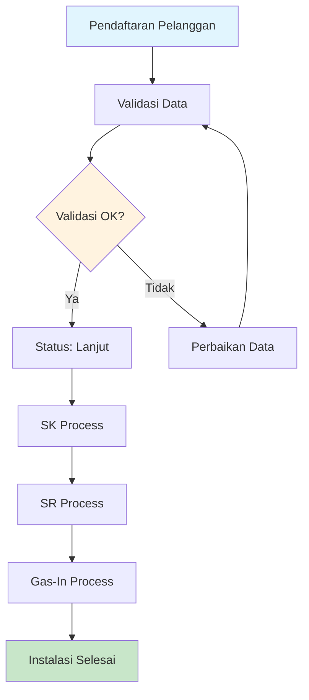
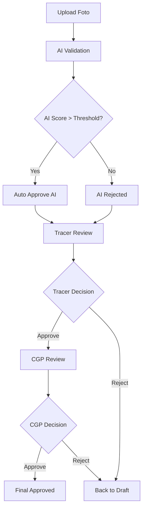

# AERGAS - MANUAL BOOK
## Sistem Manajemen Instalasi Gas Terpadu

**Version:** 2.0
**Date:** September 2025
**Platform:** Web-based Application

---

## Daftar Isi

1. [Gambaran Umum Sistem](#1-gambaran-umum-sistem)
2. [Pengguna dan Peran](#2-pengguna-dan-peran)
3. [Alur Proses Bisnis](#3-alur-proses-bisnis)
4. [Modul Pelanggan](#4-modul-pelanggan)
5. [Modul SK (Service Connection)](#5-modul-sk-service-connection)
6. [Modul SR (Service Regulator)](#6-modul-sr-service-regulator)
7. [Modul Gas-In](#7-modul-gas-in)
8. [Modul Jalur (Pipeline)](#8-modul-jalur-pipeline)
9. [Sistem Persetujuan Foto](#9-sistem-persetujuan-foto)
10. [Dashboard dan Laporan](#10-dashboard-dan-laporan)
11. [Panduan Troubleshooting](#11-panduan-troubleshooting)
12. [FAQ](#12-faq)

---

## 1. Gambaran Umum Sistem

### 1.1 Tentang AERGAS
AERGAS adalah sistem manajemen instalasi gas terpadu yang dirancang untuk mengelola seluruh siklus instalasi gas dari pendaftaran pelanggan hingga penyelesaian instalasi. Sistem ini mengintegrasikan manajemen data pelanggan, proses instalasi, sistem persetujuan foto berbasis AI, dan pelaporan komprehensif.

### 1.2 Arsitektur Sistem
- **Platform:** Web-based Application (Laravel Framework)
- **Database:** MySQL/PostgreSQL
- **Storage:** Integrated Google Drive
- **Interface:** Responsive web design (desktop & mobile)
- **Security:** Role-based access control with audit logging

### 1.3 Fitur Utama
- ✅ Manajemen multi-peran pengguna
- ✅ Workflow instalasi terintegrasi (SK → SR → Gas-In)
- ✅ Sistem persetujuan foto dengan validasi AI
- ✅ Manajemen pipeline dan jalur gas
- ✅ Dashboard real-time dan pelaporan
- ✅ Import/export data pelanggan
- ✅ Integrasi Google Drive untuk penyimpanan foto
- ✅ Audit trail lengkap

---

## 2. Pengguna dan Peran

### 2.1 Sistem Multi-Peran
Sistem AERGAS mendukung **multi-role assignment** dimana satu pengguna dapat memiliki beberapa peran sekaligus (contoh: SR + GasIn).

### 2.2 Daftar Peran

| Peran | Kode | Akses & Tanggung Jawab |
|-------|------|------------------------|
| **Super Admin** | `super_admin` | Akses penuh sistem, konfigurasi, manajemen pengguna |
| **Admin** | `admin` | Administrasi umum, validasi pelanggan, laporan |
| **SK** | `sk` | Modul Service Connection, entry data material, upload foto |
| **SR** | `sr` | Modul Service Regulator, instalasi regulator |
| **Gas-In** | `gas_in` | Proses gas-in, tes akhir, dokumentasi penyelesaian |
| **Tracer** | `tracer` | Review foto, persetujuan teknis, validasi pelanggan |
| **CGP** | `cgp` | Chief Gas Personnel, persetujuan final, sign-off |
| **Jalur** | `jalur` | Manajemen pipeline, lowering, joint instalasi |
| **PIC** | `pic` | Person in Charge, koordinasi lapangan |

### 2.3 Cara Login dan Akses
1. Buka halaman login sistem AERGAS
2. Masukkan **username** dan **password**
3. Sistem akan otomatis menampilkan menu sesuai peran yang dimiliki
4. Jika memiliki multiple roles, semua modul yang accessible akan tampil di sidebar

---

## 3. Alur Proses Bisnis

### 3.1 Alur Utama Instalasi Gas



### 3.2 Status Progress Pelanggan

| Status | Deskripsi | Next Action |
|--------|-----------|-------------|
| `pending` | Data baru, belum divalidasi | Validasi oleh Admin/Tracer |
| `lanjut` | Data valid, siap proses | Buat SK |
| `in_progress` | Dalam proses instalasi | Lanjutkan modul aktif |
| `batal` | Dibatalkan | - |

### 3.3 Progress Status

| Progress | Module | Deskripsi |
|----------|---------|-----------|
| `validasi` | - | Tahap validasi data pelanggan |
| `sk` | SK | Proses Service Connection |
| `sr` | SR | Proses Service Regulator |
| `gas_in` | Gas-In | Proses Gas-In final |
| `done` | - | Instalasi selesai 100% |
| `batal` | - | Proses dibatalkan |

---

## 4. Modul Pelanggan

### 4.1 Menambah Pelanggan Baru

**Akses:** Admin, Super Admin

1. **Navigasi:** Dashboard → Data Pelanggan → Tambah Pelanggan
2. **Isi Data Wajib:**
   - Reference ID (6 digit otomatis / custom)
   - Nama Pelanggan
   - Alamat Lengkap
   - Kelurahan
   - Padukuhan
   - No. Telepon
   - Email (opsional)

3. **Validasi:**
   - Reference ID harus unik
   - Nomor telepon format Indonesia
   - Email format valid (jika diisi)

4. **Submit:** Klik "Simpan Data Pelanggan"

### 4.2 Validasi Pelanggan

**Akses:** Admin, Tracer, Super Admin

1. **Cara Akses:**
   - Dari Data Pelanggan → Klik "View" pada pelanggan status `pending`
   - Atau langsung scan/input Reference ID

2. **Proses Validasi:**
   - Review kelengkapan data
   - Verifikasi alamat dan kontak
   - Input catatan validasi (jika ada)
   - **Update Status:** `pending` → `lanjut`

3. **Setelah Validasi:**
   - Pelanggan bisa diproses SK
   - Progress status berubah ke `validasi` → `sk`

### 4.3 Import Data Pelanggan

**Akses:** Admin, Super Admin

1. **Format Excel Template:**
   - Download template dari menu Import
   - Kolom: Reference ID, Nama, Alamat, Kelurahan, Padukuhan, Telepon, Email

2. **Upload Process:**
   - Browse file Excel (.xlsx, .xls)
   - Validasi otomatis format dan data
   - Preview data sebelum import final
   - Import dengan konfirmasi

3. **Error Handling:**
   - Data duplikat akan dilewati
   - Error validation ditampilkan per baris
   - Import parsial untuk data valid

---

## 5. Modul SK (Service Connection)

### 5.1 Membuat SK Baru

**Akses:** SK, Super Admin

**Prerequisites:** Customer status = `lanjut`

1. **Navigasi:** Dashboard → SK → Buat SK
2. **Input Reference ID:** Sistem akan auto-fill data pelanggan
3. **Data Instalasi:**
   - Tanggal Instalasi (wajib)
   - Nama Petugas (otomatis dari user login)
   - Catatan (opsional)

### 5.2 Entry Material SK

**Material Wajib (Sesuai Isometrik):**

| Material | Satuan | Validasi |
|----------|---------|----------|
| Panjang Pipa 1/2" GL Medium | meter | min: 0, max: 1000 |
| Elbow 1/2" Galvanis | pcs | min: 0, max: 100 |
| SockDraft Galvanis 1/2" | pcs | min: 0, max: 100 |
| Ball Valve 1/2" | pcs | min: 0, max: 100 |
| Nipel Selang 1/2" | pcs | min: 0, max: 100 |
| Elbow Reduce 3/4" x 1/2" | pcs | min: 0, max: 100 |
| Long Elbow 3/4" Male Female | pcs | min: 0, max: 100 |
| Klem Pipa 1/2" | pcs | min: 0, max: 100 |
| Double Nipple 1/2" | pcs | min: 0, max: 100 |
| Seal Tape | pcs | min: 0, max: 100 |
| **Tee 1/2"** | pcs | **OPSIONAL**, min: 0, max: 100 |

**Fitur Auto-Calculate:**
- Total fitting terhitung otomatis
- Status kelengkapan real-time
- Validasi sesuai standar isometrik

### 5.3 Upload Foto SK

**Foto Wajib:**

1. **Foto Pneumatic START SK**
   - Format: JPG, PNG, WEBP
   - Max size: 35MB
   - Konten: Foto peralatan pneumatic sebelum instalasi

2. **Foto Pneumatic FINISH SK**
   - Format: JPG, PNG, WEBP
   - Max size: 35MB
   - Konten: Foto peralatan pneumatic setelah instalasi

3. **Foto Valve SK**
   - Format: JPG, PNG, WEBP
   - Max size: 35MB
   - Konten: Foto valve yang terpasang

4. **Scan Isometrik SK (TTD lengkap)**
   - Format: JPG, PNG, WEBP, PDF
   - Max size: 35MB
   - Konten: Gambar isometrik lengkap dengan tanda tangan

**Upload Methods:**
- **Upload File:** Drag & drop atau browse file
- **Google Drive Link:** Paste link Google Drive

### 5.4 Status dan Approval SK

**Alur Status:**
1. `draft` → Data entry dan upload foto
2. `ready_for_tracer` → Siap review tracer (otomatis jika foto lengkap)
3. `acc_tracer` → Disetujui tracer
4. `acc_cgp` → Disetujui CGP (final approval)
5. `completed` → SK selesai, bisa lanjut SR

**Revision Status:**
- `revisi_tracer` → Tracer minta revisi
- `revisi_cgp` → CGP minta revisi

---

## 6. Modul SR (Service Regulator)

### 6.1 Membuat SR Baru

**Akses:** SR, Super Admin

**Prerequisites:** SK status = `completed`

1. **Navigasi:** Dashboard → SR → Buat SR
2. **Input Reference ID:** Auto-fill data pelanggan + data SK
3. **Data Instalasi:**
   - Tanggal Pemasangan (wajib)
   - Jenis Tapping (dropdown)
   - Catatan (opsional)

### 6.2 Entry Material SR

**Material Wajib:**

| Material | Satuan | Validasi |
|----------|---------|----------|
| Tapping Saddle | pcs | min: 0, max: 100 |
| Coupler 20mm | pcs | min: 0, max: 100 |
| Panjang Pipa PE 20mm | meter | min: 0, max: 1000 |
| Elbow 90x20 | pcs | min: 0, max: 100 |
| Transition Fitting | pcs | min: 0, max: 100 |
| Panjang Pondasi Tiang SR | meter | min: 0, max: 100 |
| Panjang Pipa Galvanize 3/4" | meter | min: 0, max: 100 |
| Klem Pipa | pcs | min: 0, max: 100 |
| Ball Valve 3/4" | pcs | min: 0, max: 100 |
| Double Nipple 3/4" | pcs | min: 0, max: 100 |
| Long Elbow 3/4" | pcs | min: 0, max: 100 |
| Regulator Service | pcs | min: 0, max: 100 |
| Panjang Casing 1 inch | meter | min: 0, max: 100 |
| Seal Tape | pcs | min: 0, max: 100 |

**Material Opsional (Tergantung Jenis Tapping):**
- Panjang Pipa PE (meter)
- Panjang Casing Crossing (meter)

### 6.3 Upload Foto SR

**Foto Wajib:**

1. **Foto Pneumatic START SR**
2. **Foto Pneumatic FINISH SR**
3. **Foto Jenis Tapping**
4. **Foto Pondasi SR**
5. **Scan Isometrik SR (TTD lengkap)**

**Validasi AI:**
- AI akan memvalidasi kesesuaian foto dengan requirement
- Score confidence ditampilkan
- Status approval otomatis jika AI score tinggi

---

## 7. Modul Gas-In

### 7.1 Membuat Gas-In Baru

**Akses:** Gas-In, Super Admin

**Prerequisites:** SK dan SR status = `completed`

1. **Navigasi:** Dashboard → Gas-In → Buat Gas-In
2. **Input Reference ID:** Auto-fill semua data sebelumnya
3. **Data Gas-In:**
   - Tanggal Gas-In (wajib)
   - Petugas Gas-In (otomatis)
   - Catatan final (opsional)

### 7.2 Upload Foto Gas-In

**Foto Wajib:**

1. **Foto BA Gas-In**
   - Berita Acara Gas-In dengan tanda tangan
   - Format: JPG, PNG, WEBP, PDF

2. **Foto Bubble Test**
   - Dokumentasi tes kebocoran dengan bubble test
   - Harus menunjukkan tidak ada kebocoran

3. **Foto Regulator**
   - Regulator terpasang dan berfungsi
   - Clear visibility dari pressure gauge

4. **Foto Kompor Menyala**
   - Dokumentasi kompor sudah bisa menyala normal
   - Bukti gas sudah flowing dengan baik

### 7.3 Finalisasi Gas-In

Setelah semua foto diapprove:
1. Status customer berubah ke `done`
2. Progress menjadi 100%
3. Instalasi dianggap selesai
4. Generate Berita Acara otomatis

---

## 8. Modul Jalur (Pipeline)

### 8.1 Manajemen Cluster dan Line

**Hierarki Organisasi:**
```
Cluster → Line Number → Lowering Data
```

**Akses:** Jalur, Super Admin

### 8.2 Data Lowering

**Input Data Lowering:**

1. **Informasi Dasar:**
   - Line Number (dropdown dari cluster)
   - Nama Jalan
   - Tanggal Jalur

2. **Tipe Bongkaran:**
   - Open Cut
   - Crossing
   - Zinker
   - Manual Boring
   - Manual Boring - PK

3. **Tipe Material Bongkaran:**
   - Aspal
   - Tanah
   - Paving

4. **Progress Data:**
   - Panjang Lowering (meter)
   - Bongkaran/Manual Boring (meter)
   - Kedalaman Lowering (cm)

### 8.3 Aksesoris Berdasarkan Tipe

**Open Cut:**
- ✅ Marker Tape (quantity + foto)
- ✅ Concrete Slab (quantity + foto)
- ✅ Cassing (quantity + type + foto)

**Crossing/Zinker:**
- ✅ Cassing (quantity + type + foto)

**Manual Boring:**
- Tidak ada aksesoris tambahan

### 8.4 Foto Evidence Jalur

**Foto Wajib:**
1. **Foto Evidence Lowering Harian**
2. **Foto Evidence Kedalaman Lowering**

**Foto Aksesoris (conditional):**
- Foto Evidence Marker Tape (jika Open Cut)
- Foto Evidence Concrete Slab (jika Open Cut)
- Foto Evidence Cassing (jika Open Cut/Crossing/Zinker)

---

## 9. Sistem Persetujuan Foto

### 9.1 Alur Approval



### 9.2 Status Foto

| Status | Deskripsi | Next Action |
|--------|-----------|-------------|
| `draft` | Foto baru upload | AI validation |
| `ai_pending` | Menunggu AI processing | Automated |
| `ai_approved` | AI approve | Tracer review |
| `ai_rejected` | AI reject | Manual tracer review |
| `tracer_pending` | Menunggu tracer | Tracer action |
| `tracer_approved` | Tracer approve | CGP review |
| `tracer_rejected` | Tracer reject | Upload ulang |
| `cgp_pending` | Menunggu CGP | CGP action |
| `cgp_approved` | Final approved | Complete |
| `cgp_rejected` | CGP reject | Upload ulang |

### 9.3 Panduan Review Foto

**Untuk Tracer:**
1. Check foto sesuai requirement
2. Pastikan kualitas foto clear dan readable
3. Verifikasi isi foto match dengan data entry
4. Berikan notes jika reject

**Untuk CGP:**
1. Final quality check
2. Safety compliance verification
3. Sign-off untuk completion
4. Authorize next phase progression

---

## 10. Dashboard dan Laporan

### 10.1 Dashboard Overview

**Metrics Utama:**
- Total Pelanggan per Status
- Progress Instalasi Real-time
- Photo Approval Queue
- Performance Metrics (completion rate, avg processing time)

**Widget Available:**
- 📊 Statistics Cards
- 📈 Trend Charts (daily, weekly, monthly)
- 📋 Recent Activities
- ⚠️ Pending Approvals
- 🎯 Performance KPIs

### 10.2 Laporan Available

**Customer Reports:**
- Customer List dengan filter status
- Installation Progress Report
- Performance by Region/Cluster

**Module Reports:**
- SK/SR/Gas-In completion reports
- Material usage reports
- Photo approval statistics

**Operational Reports:**
- Daily/Weekly/Monthly summaries
- Technician performance
- Approval bottleneck analysis

### 10.3 Export Capabilities

**Format Export:**
- Excel (.xlsx)
- PDF reports
- CSV data

**Export Options:**
- Filtered data export
- Custom date range
- Template-based reports

---

## 11. Panduan Troubleshooting

### 11.1 Masalah Login

**Problem:** Tidak bisa login
**Solution:**
1. Pastikan username/password benar
2. Check caps lock
3. Clear browser cache
4. Hubungi admin untuk reset password

### 11.2 Error Upload Foto

**Problem:** Foto tidak bisa diupload
**Solution:**
1. Check file size (max 35MB)
2. Check format file (JPG, PNG, WEBP, PDF)
3. Check koneksi internet
4. Coba upload ulang setelah beberapa menit

**Problem:** Google Drive link tidak bisa diakses
**Solution:**
1. Pastikan link sharing setting = "Anyone with link can view"
2. Copy full sharing link dari Google Drive
3. Pastikan file tidak terhapus dari Drive

### 11.3 Error Validation

**Problem:** Error 422 saat submit form
**Solution:**
1. Check semua field wajib sudah diisi
2. Pastikan Reference ID belum ada (untuk create baru)
3. Check format input (angka, tanggal, dll)
4. Refresh halaman dan coba lagi

### 11.4 Data Tidak Muncul

**Problem:** Data pelanggan tidak muncul di dropdown
**Solution:**
1. Pastikan customer status = `lanjut`
2. Check prerequisite module sudah completed
3. Refresh halaman
4. Check permission/role access

---

## 12. FAQ

### 12.1 General

**Q: Bisakah satu user memiliki beberapa role?**
A: Ya, sistem mendukung multi-role. Satu user bisa memiliki role SR + GasIn misalnya.

**Q: Bagaimana cara mengubah password?**
A: Login → Profile → Change Password, atau hubungi admin.

**Q: Apakah data bisa diimport dari Excel?**
A: Ya, tersedia fitur import untuk data pelanggan dengan template Excel.

### 12.2 Process Flow

**Q: Bisakah SK dibuat tanpa menunggu customer divalidasi?**
A: Tidak, customer harus status `lanjut` dulu sebelum bisa buat SK.

**Q: Bisakah SR dibuat sebelum SK selesai?**
A: Tidak, SR memerlukan SK status `completed` terlebih dahulu.

**Q: Bagaimana jika foto di-reject oleh tracer?**
A: Status kembali ke draft, harus upload foto baru yang sesuai requirement.

### 12.3 Photo Management

**Q: Berapa maksimal ukuran foto yang bisa diupload?**
A: Maksimal 35MB per foto.

**Q: Format foto apa saja yang didukung?**
A: JPG, PNG, WEBP untuk foto. PDF untuk dokumen seperti isometrik.

**Q: Apakah bisa menggunakan Google Drive?**
A: Ya, bisa paste sharing link Google Drive sebagai alternatif upload.

### 12.4 Reports

**Q: Bagaimana cara export data pelanggan?**
A: Dashboard → Data Pelanggan → Export → Pilih format (Excel/PDF/CSV).

**Q: Bisakah membuat laporan custom?**
A: Tersedia filter dan date range untuk customize laporan sesuai kebutuhan.

---

## Kontak Support

**Technical Support:**
📧 Email: support@aergas.com
📱 Phone: +62-xxx-xxxx-xxxx
🕒 Jam Kerja: Senin-Jumat 08:00-17:00 WIB

**Admin System:**
📧 Email: admin@aergas.com

---

*Manual Book AERGAS v2.0 - September 2025*
*© AERGAS - Gas Installation Management System*